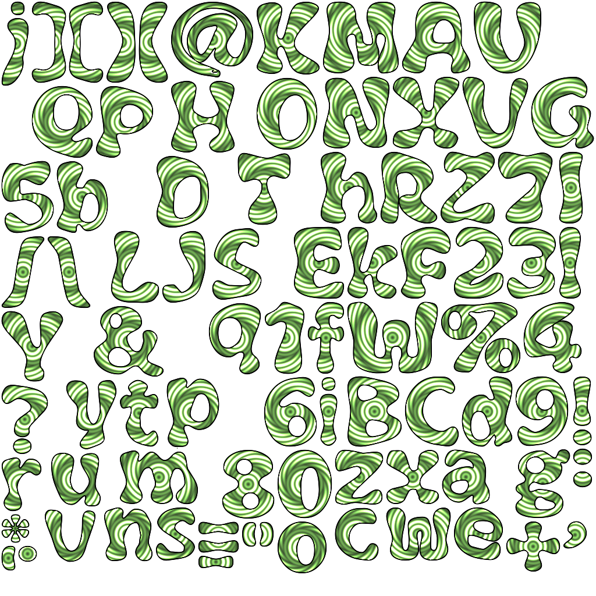

# SdfFontDesigner

these font map was obtained with SdfFontDesigner
not sure if they are good enough for production btw :)

### Day Of Tentacle Style Font

### Tests

### Sdf (Font Dilatation)

### first Imports

