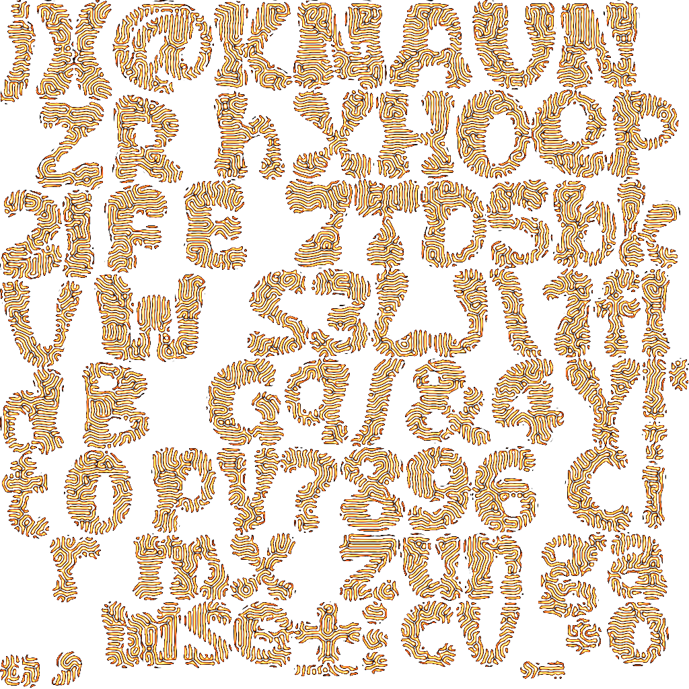
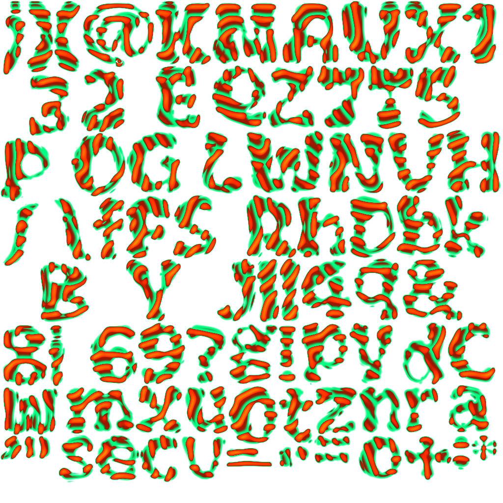
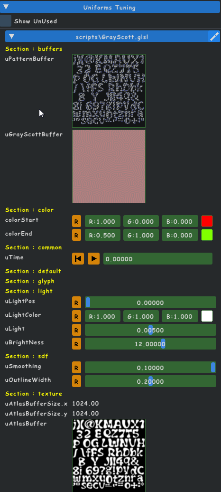
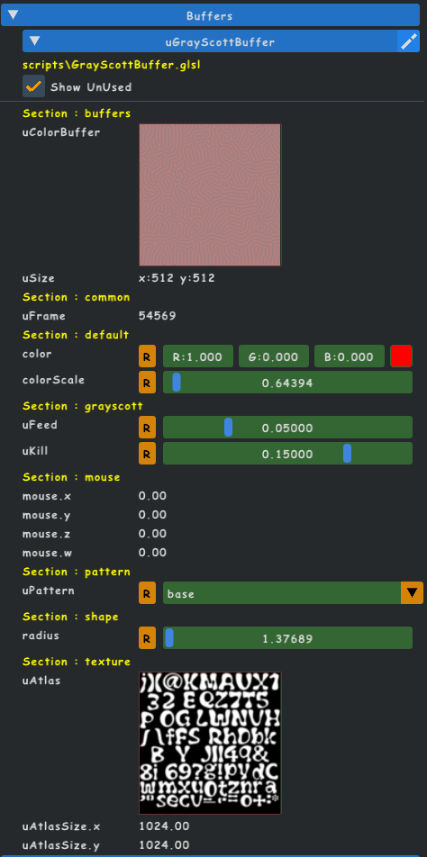
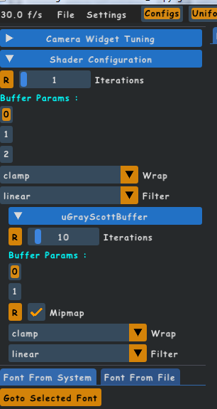
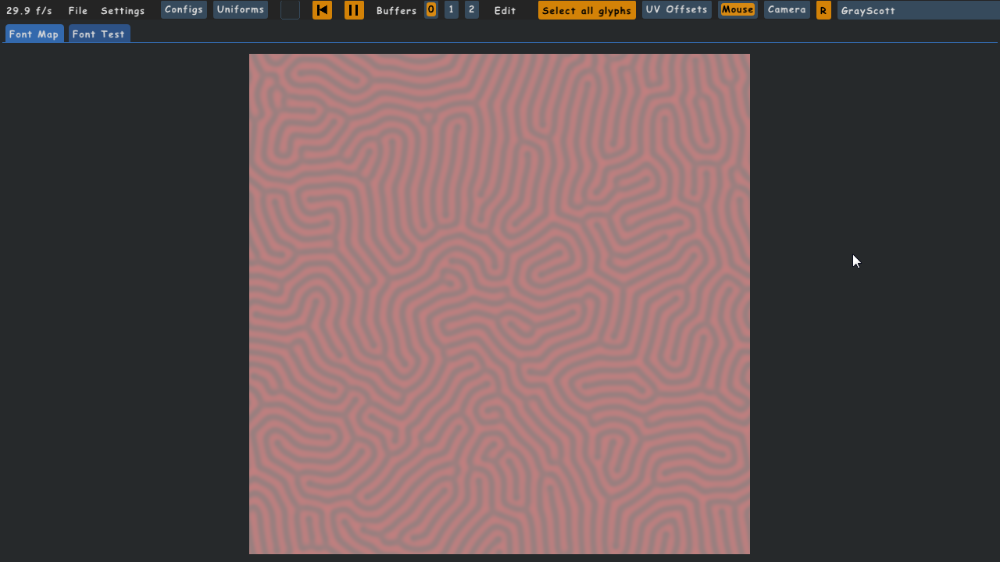
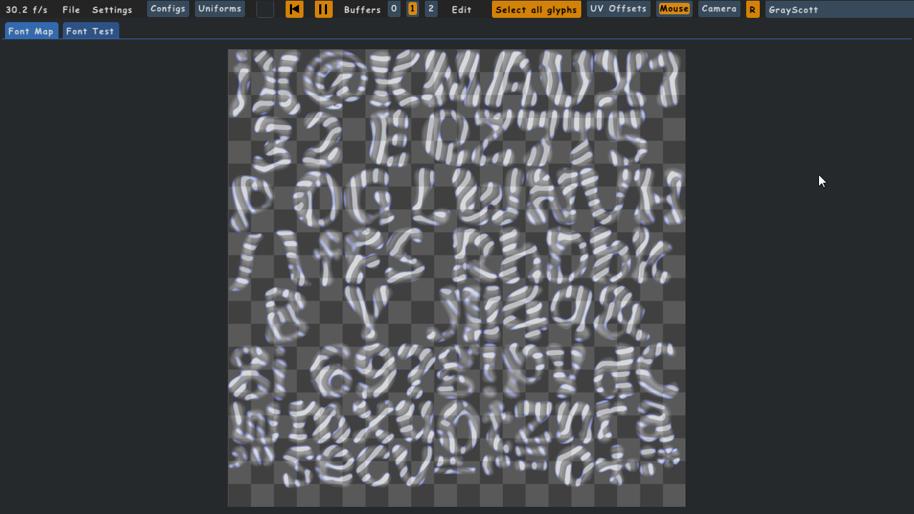
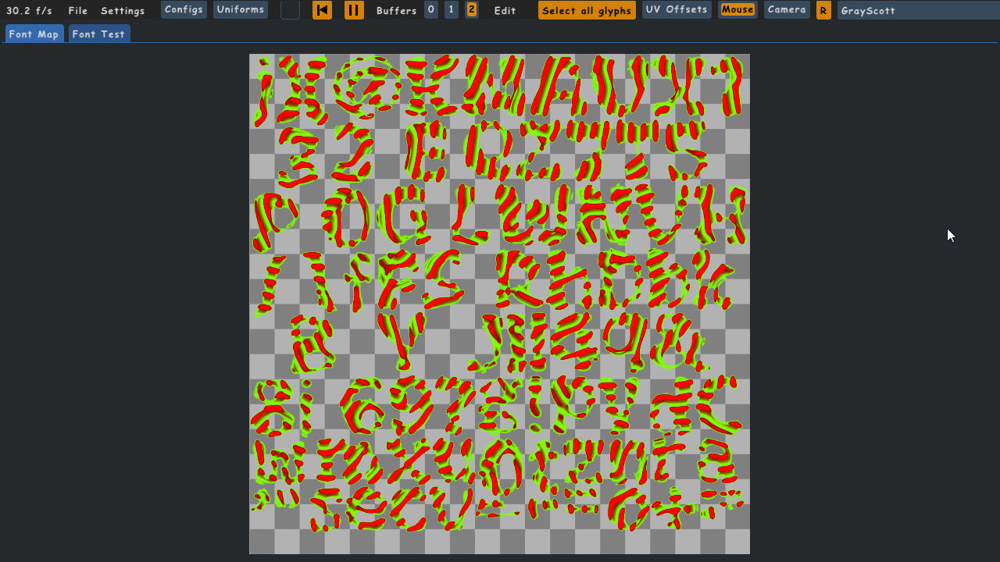
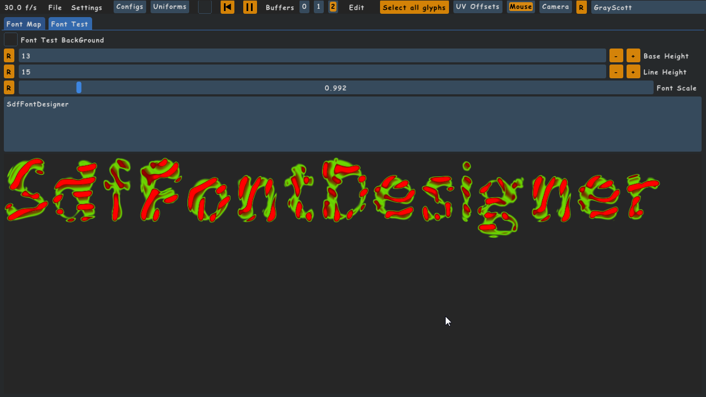

# GrayScott Sample (Reaction Diffusion)

## there is two files here :

The main script it called : GrayScott.glsl
The second one is the child buffer : GrayScottBuffer.glsl

## who can produce these font maps :

## you have somes widgets to tune in the "Uniforms Tunings Sheet" :

### for the main Shader :

 

### for the child buffer :

### you can control grow speed on the lft pane here :

## the pictures are :

## the font preview :

