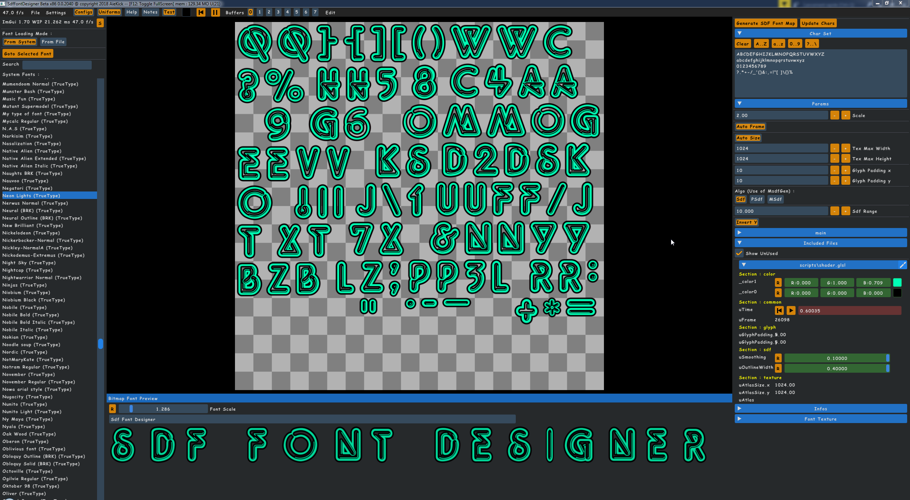
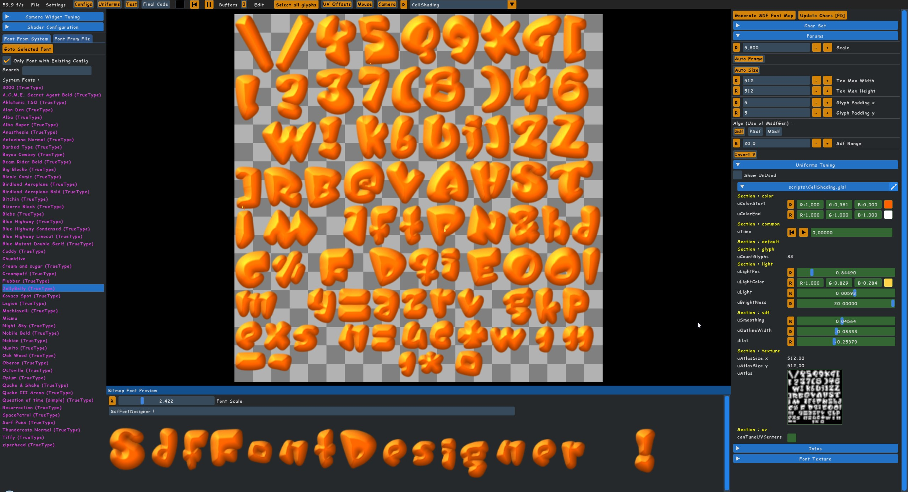
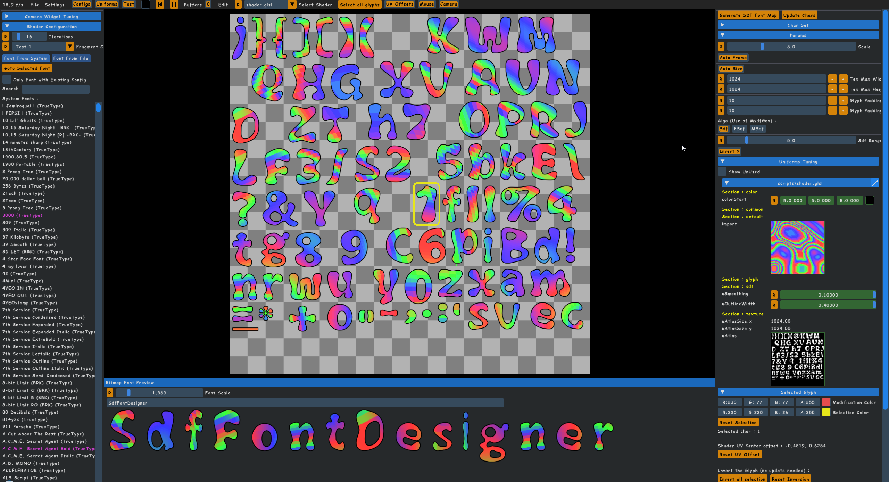
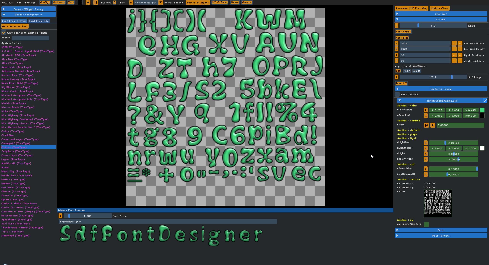
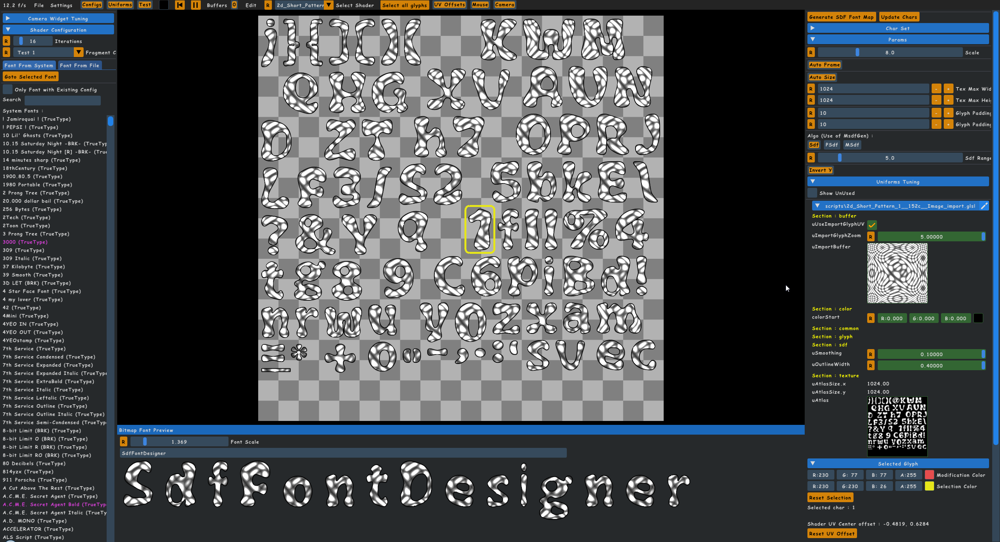
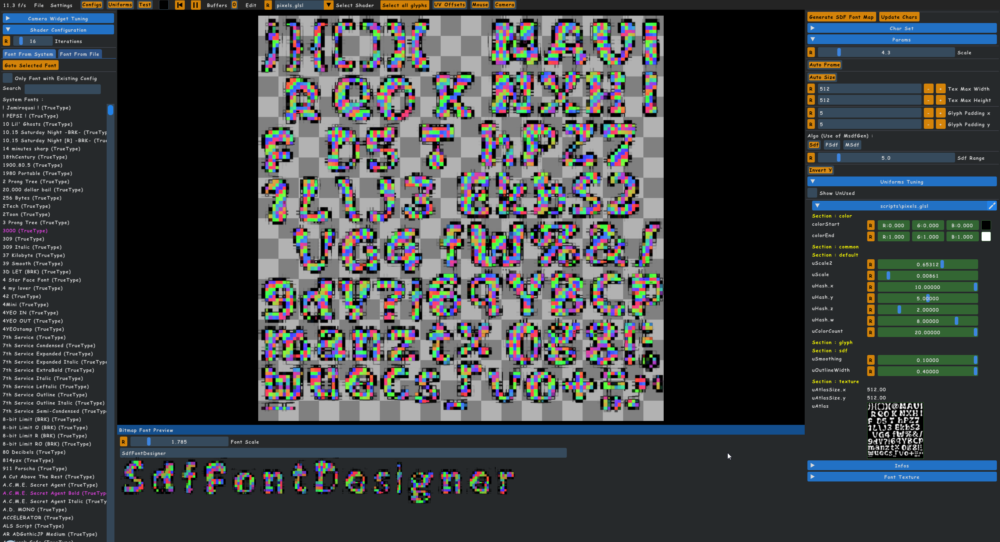
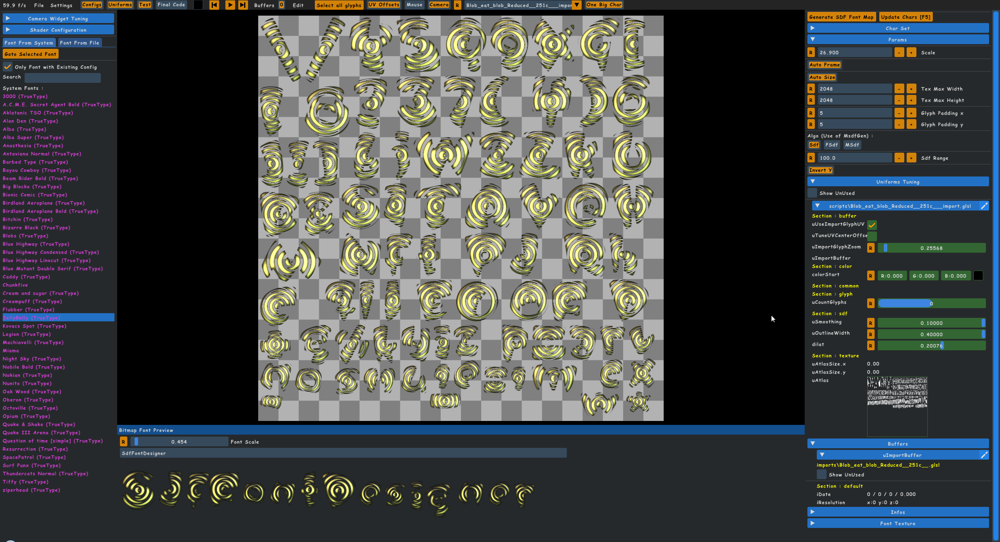
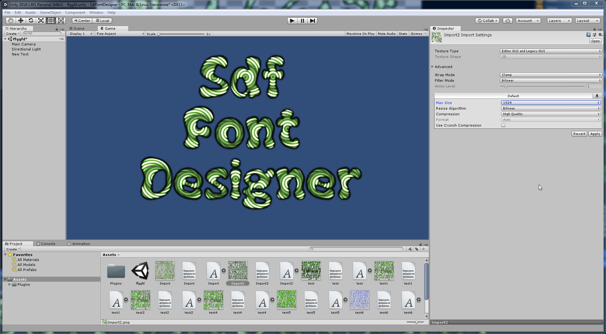

# SdfFontDesigner

SdfFontDesigner i a tool for create font bitmap with shader in glsl

available only on windows for the moment, require Opengl 3.3 mini

Download here : https://github.com/aiekick/SdfFontDesigner/releases

Also Available on Itch.Io => https://aiekick.itch.io/sdffontdesigner

In this Repo you will find Samples Script with generated Bitmap Font for testing

SdfFontDesigner can :

- Font bitmap based on ttf or otf font files / systems,
- Write your own shaders (in glsl) for tuning and rendering like you want
- Offer many usefull uniforms widget from code, let Programmers write shaders and let artists tune these for have result they want.
- Export the font bitmap to the .fnt file format for using it in many game  engine like unity, unreal, cocos2ds, libgdx, etc..
- Import Shaders from ShaderToy and GlslSandbox (new in v0.0.2472)
- Support multipass shaders like needed in fluid simulation or Reaction Diffusion like here [GrayScott](https://github.com/aiekick/SdfFontDesigner/tree/master/GrayScott)
- Exactly the same GLSL System / widgets and possibilities than used in [NoodlesPlate v0.1.974](https://github.com/aiekick/NoodlesPlate/releases/tag/v0.1.974)

## Demo Pictures : ##

## View in Unity3D Engine : ##

